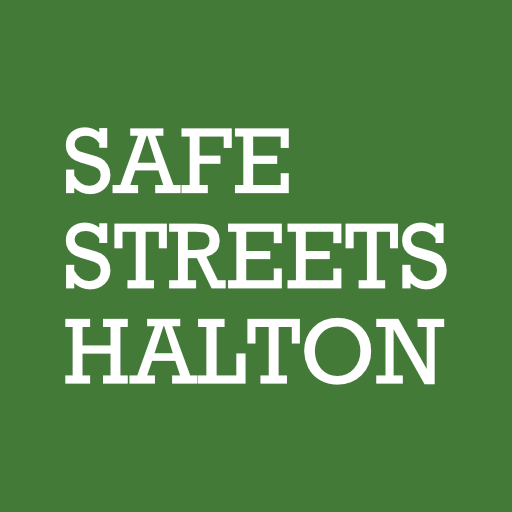
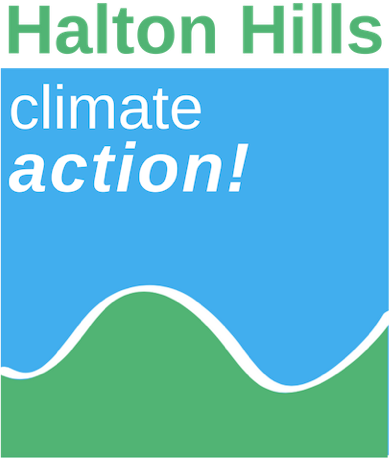

[PDF Version](../assets/ON-Bill-212-open-letter.pdf)

As representatives for [Safe Streets Halton](https://www.safestreetshalton.ca/), [Oakvillegreen](https://www.oakvillegreen.org/), [BurlingtonGreen](https://www.burlingtongreen.org/), [Halton Hills Climate Action](https://www.haltonhillsclimateaction.com/), and [Halton Environmental Network](https://www.haltonenvironment.ca/), we are writing to express our concern for the recently tabled Bill 212. The changes in this bill will restrict municipalities’ response to growth-related infrastructure needs, put residents at risk, limit sustainable transportation options and harm the environment.

All commuters have a right to get to their destination safely, regardless of how they get around. Removing cyclist protections would result in more traffic deaths, injuries, and unsafe road conditions. Without safe infrastructure, the government effectively punishes pedestrians and cyclists, and risks their lives and well-being whenever they travel to work, school, or activities.

Moreover, removing or putting restrictions on bike lanes would not solve the traffic congestion problem that municipalities in Halton Region face. A mixed-transportation model is the best way to ensure smooth traffic flow among a growing population. [According to research](https://www.researchgate.net/figure/Space-efficiencies-of-car-tram-bike-and-walking_fig5_232847647), cars take up to 14 times the public space of a moving bike. Taking this option away from municipalities would mean silencing the voices of residents who live in those communities and ignoring their unique needs. For example, not everyone can afford additional vehicles (and the associated maintenance and repair costs), such as those living on fixed or limited incomes. Municipalities would also be faced with additional road maintenance and an increased demand for parking, with those costs placed on residents through higher taxes. 

Prioritizing cars would have a detrimental effect on the environment and people’s health. [44% of emissions in Halton Region are from motor vehicles](https://www.halton.ca/The-Region/Climate-Change-and-the-Environment), contributing to poor air quality and climate change. The government should encourage sustainable transportation wherever possible to benefit Ontarians’ health and surroundings.

The changes proposed in Bill 212 will put people, communities and the environment at increased risk. We strongly urge the provincial government to rethink this legislation and focus on creating safer streets for all road users.

Sincerely the undersigned:

 
Nick Morrison 
President 
<a href="https://www.safestreetshalton.ca/">Safe Streets Halton</a>

 
Janet Duval 
Communications Officer 
<a href="https://www.haltonhillsclimateaction.com/">Halton Hills Climate Action</a>

 
Amy Schurr 
Co-Founder & Executive Director 
<a href="https://www.burlingtongreen.org/">BurlingtonGreen Environmental Association</a>

 
Karen Brock 
President 
<a href="https://www.oakvillegreen.org/">Oakvillegreen Conservation Association</a>

 
Marsha Smith 
Interim Executive Director 
<a href="https://www.haltonenvironment.ca/">Halton Environmental Network</a>

